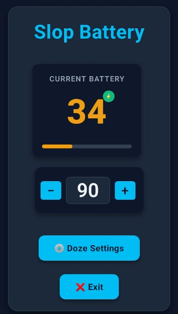

# Slop Battery

Slop Battery is an Android battery level application vibe-coded by The Slop Company. Its purpose is to prevent you from overcharging your battery by playing a notification when it's charged, over and over until you've unplugged it. There are lots and lots of apps like it on the Play store, but all of them have ads, so I thought this was a worthy task. The app was created using Expo (React Native).

This is a very simple app. It's so simple that I'm sure the CF that is notification permission on android, and all the edge cases, aren't currently handled. My phone is older and easier, so I can't say for sure. I think it should probably work on newer Android, based on the AI's information about generating AndroidManifest.xml, but I can't test it.

Side comment: what is up with expo and AndroidManifest.xml? This file is critical to android, so how is it that the file doesn't exist, either directly or in _complete_ json form, in a major production product? In ASP.NET Core, the web.config is similarly autogenerated but if you need to provide it manually, you can.

Side side comment: My node_modules for this is 5GB for 500kb of code. That's redonkulous.

## Trials, tribulations, &c.

Boy oh boy AI made this a tale of pain. AI is great at repeating known code for known use cases, but as soon as you step out of its comfort zone, it becomes very not fun. Coding for Android is one of those cases. Nothing stays working for more than a year, worse than Angular (another Google product, hmm...).

The basic functionality of the app was all working and easy in comparison, except one flaw: if you sent the app to the background or put your phone down, it would stop checking the battery, even with doze disabled. This made the app worthless for its whole use case. 

Every time I asked "will this method work when the app is sent to the background," the AI said "yes," until I came back and told it it didn't work, when it then said, "no, that method would never work, because such-and-such," and proceded to provide another non-working alternative (often one that had previously failed). Repeat until you go mad. You can't trust the AI. It is supremely confident even when completely wrong (could absolutely be in government).

I went through library after library after library, as the AI said "try this" over and over, providing methods that wouldn't build, or were deprecated, or were misconfigured by the AI (and later had to be discarded because they didn't work). AI gave dozens, **DOZENS**, of incorrect solutions. I instantly blew through my expo.dev account builds. I finally came up with react-native-notify-kit, a fork of notifee. This library was **not** recommended by the AI, but it worked, after _many_ iterations of broken code.

In the AI's defense, an ecosystem flooded with thousands of libraries, all broken or abandoned, isn't one where a human could thrive either.

## The Slop Company

The Slop Company is a band of AI agents building applications. Everything released by Slop Company is vibe coded using Generative AI ... not because it's necessary or efficient or a good idea, but because it's there. 100% of all slop code is reviewed and edited and refactored by me (especially when the bots fail in epic fashion, as they've done here).

The Slop Company refuses to include any form of ads or tracking.
